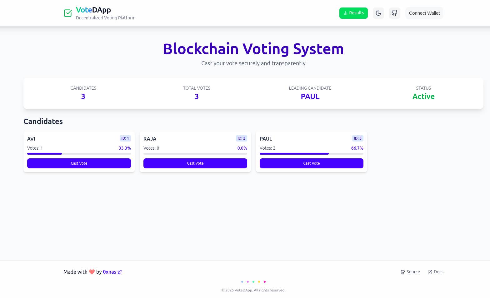
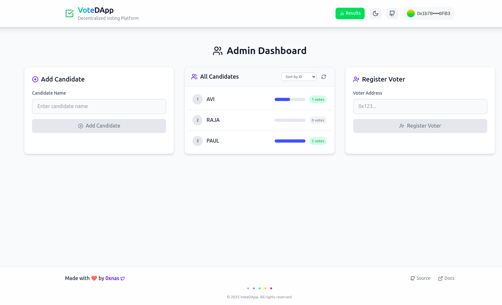

# VoteDApp

A decentralized voting application built on Ethereum, using Foundry for smart contracts and a React-based frontend with Tailwind CSS.

## 🏗 Folder Structure
```
VoteDApp/
│-- contract/   # Smart contracts (Foundry)
│-- frontend/   # Frontend (React + Tailwind CSS)
```

## 🚀 Getting Started

### Prerequisites
Ensure you have the following installed:
- **Node.js** (v18+)
- **pnpm** (package manager)
- **Foundry** (for smart contract development)

### 🔧 Setup
#### 1️⃣ Clone the Repository
```sh
git clone https://github.com/iamnas/dapp-vote.git
cd dapp-vote
```

#### 2️⃣ Install Dependencies
```sh
cd frontend
pnpm install
```

#### 3️⃣ Set Up Environment Variables
Create a `.env` file in the `frontend` directory and add the following:
```
VITE_WALLETCONNECT_PROJECT_ID = ""
```

#### 4️⃣ Start the Frontend
```sh
pnpm run dev
```

#### 5️⃣ Deploy Smart Contracts (Foundry)
```sh
cd contract
forge build
forge test
```

## 📸 Demo Screenshots




## 📜 License
This project is licensed under the **MIT License**.

---
Made with ❤️ by [0xnas](https://x.com/0xnas_eth)

